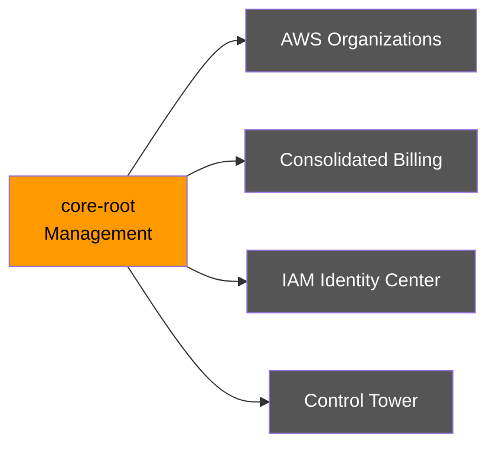
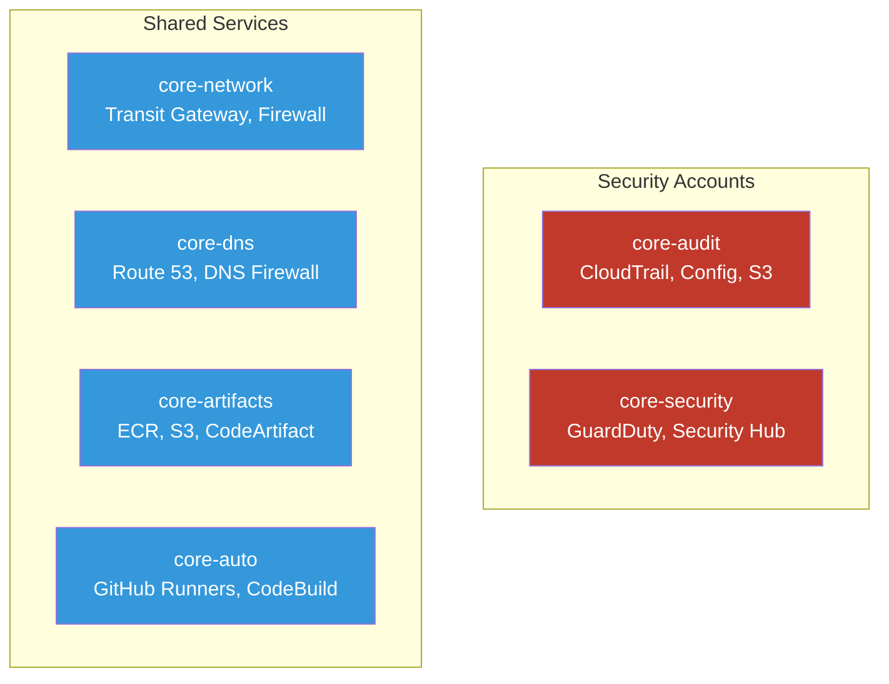
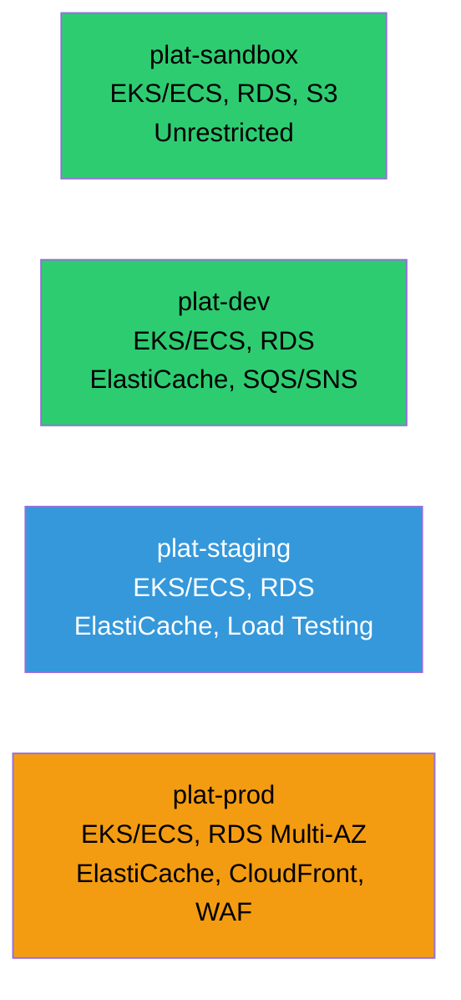

# Account Details

Detailed breakdown of each AWS account and its purpose.

## Management Account

### Key Services
- **AWS Organizations**: Manage all member accounts
- **Consolidated Billing**: Single billing for all accounts
- **IAM Identity Center**: Centralized SSO and access management
- **Control Tower**: Automated account provisioning and governance

---

## Core OU - Foundation Accounts

### core-audit
- **CloudTrail**: Organization-wide audit logs
- **AWS Config**: Resource compliance tracking
- **S3 Audit Buckets**: Centralized log storage with encryption
- **Athena**: Log analysis and querying

### core-security
- **GuardDuty**: Delegated administrator for threat detection
- **Security Hub**: Centralized security findings
- **Inspector**: Vulnerability scanning
- **Macie**: Data security and privacy

### core-network
- **Transit Gateway**: Central network hub
- **Network Firewall**: Centralized traffic inspection
- **Route 53 Resolver**: DNS resolution
- **Client VPN**: Remote access for developers

### core-dns
- **Route 53 Hosted Zones**: Domain management and registration
- **DNS Firewall**: Malicious domain blocking
- **ACM**: Public certificate management
- **Health Checks**: Endpoint monitoring

### core-artifacts
- **ECR**: Shared container images
- **S3**: Artifact storage (Terraform state, build artifacts)
- **CodeArtifact**: Package repository
- **Terraform State**: Centralized state management

### core-auto
- **GitHub Runners (EC2)**: Self-hosted CI/CD runners
- **CodeBuild**: Build automation
- **CodePipeline**: Deployment pipelines
- **Spacelift/Atlantis**: Terraform automation

---

## Platform OU - Workload Accounts

### plat-sandbox
- **Purpose**: Experimental workloads and developer testing
- **Key Services**: EKS/ECS, RDS, Lambda, S3
- **Access**: Unrestricted experimentation
- **Owner**: Developers

### plat-dev
- **Purpose**: Development environment for feature branches
- **Key Services**: EKS/ECS, RDS, ElastiCache, SQS/SNS
- **Access**: Developer full access
- **Owner**: Developers

### plat-staging
- **Purpose**: Pre-production testing and QA validation
- **Key Services**: EKS/ECS, RDS (production-like), ElastiCache, Load Testing
- **Access**: Platform team and QA
- **Owner**: Platform Team

### plat-prod
- **Purpose**: Production workloads serving live traffic
- **Key Services**: EKS/ECS, RDS (Multi-AZ), ElastiCache, CloudFront, WAF
- **Access**: Restricted, read-only for most users
- **Owner**: Platform Team
