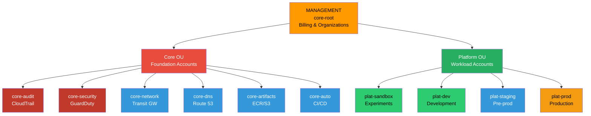

# Organization Overview

Hierarchical AWS Organization structure with Organizational Units and account hierarchy.

## Key Features

- **Management Account (core-root)**: Organization management and billing consolidation
- **Core OU**: Foundation accounts for shared services (artifacts, audit, auto, dns, network, security)
- **Platform OU**: Workload accounts for different environments (sandbox, dev, staging, prod)
- **Service Control Policies**: Organizational guardrails applied at OU level
- **Account-level isolation**: Each account provides security boundary with cross-account access patterns
