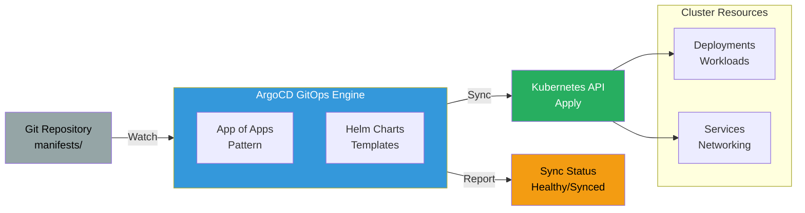

# ArgoCD GitOps

Kubernetes deployments with GitOps workflow.

## Problems this Architecture solves

- Prevents cluster drift by continuously reconciling live state back to what is declared in Git.
- Reduces manual `kubectl` deployment workflows that are hard to audit and roll back safely.
- Improves visibility into release health with explicit sync and application status in the control plane.



## Key Features

- **GitOps**: Git as single source of truth for cluster state
- **Auto-Sync**: Automatically apply changes from Git
- **Self-Heal**: Revert manual changes to match Git
- **Pruning**: Delete resources removed from Git
- **App of Apps**: Manage multiple applications from single repo
- **Rollback**: Easy rollback to previous Git commit

## GitOps Workflow

### 1. Developer Updates Manifest
- Edit Kubernetes manifests in Git
- Update image tag, replicas, config
- Commit and push to repository

### 2. ArgoCD Watches Repository
- ArgoCD polls Git every 3 minutes
- Detects changes to manifests
- Compares desired state (Git) vs actual state (cluster)

### 3. ArgoCD Syncs Changes
- Applies changes to Kubernetes API
- Creates/updates/deletes resources
- Waits for resources to become healthy

### 4. Sync Status Reported
- **Synced**: Cluster matches Git
- **OutOfSync**: Manual changes detected
- **Healthy**: All resources running
- **Degraded**: Some resources failing

## App of Apps Pattern

```yaml
apiVersion: argoproj.io/v1alpha1
kind: Application
metadata:
  name: root-app
spec:
  source:
    repoURL: https://github.com/acme/k8s-manifests
    path: apps/
  destination:
    server: https://kubernetes.default.svc
```

### Structure
```
k8s-manifests/
├── apps/
│   ├── api.yaml
│   ├── worker.yaml
│   └── cron.yaml
├── api/
│   ├── deployment.yaml
│   ├── service.yaml
│   └── ingress.yaml
├── worker/
│   └── deployment.yaml
└── cron/
    └── cronjob.yaml
```

## Helm Integration

ArgoCD supports Helm charts with values overrides:

```yaml
apiVersion: argoproj.io/v1alpha1
kind: Application
metadata:
  name: api
spec:
  source:
    repoURL: https://github.com/acme/helm-charts
    path: api/
    helm:
      values: |
        image:
          tag: v1.2.3
        replicas: 3
```

## Benefits

- **Declarative**: Desired state defined in Git
- **Auditable**: All changes tracked in Git history
- **Recoverable**: Easy rollback to any previous state
- **Consistent**: Same deployment process across environments
- **Secure**: No kubectl access needed for deployments
