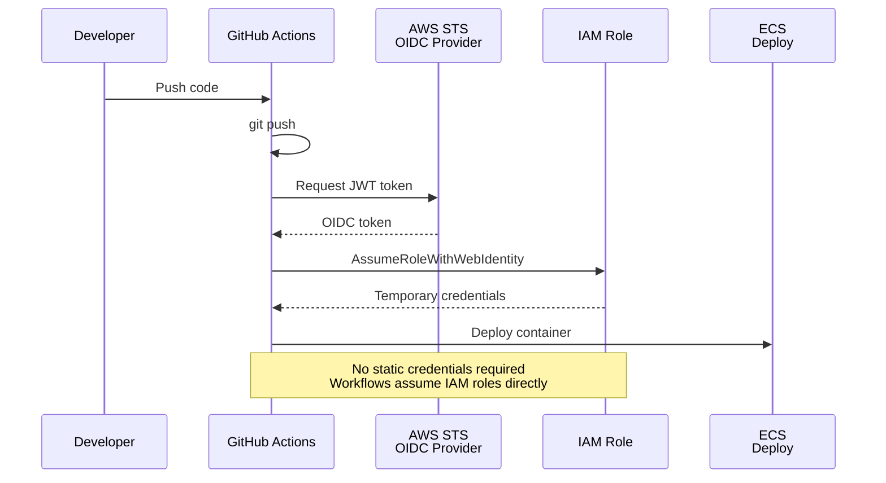

# GitHub OIDC to AWS Authentication

GitHub Actions authenticates to AWS using OIDC federation — no static credentials required, workflows assume IAM roles directly.



## Key Features

- **No Static Credentials**: No AWS access keys stored in GitHub secrets
- **Short-Lived Tokens**: Temporary credentials expire after 1 hour
- **Fine-Grained Permissions**: Different roles for different workflows
- **Audit Trail**: CloudTrail logs all AssumeRole operations
- **Branch/Tag Restrictions**: Limit which branches can assume roles

## Authentication Flow

### 1. Developer Pushes Code
- Developer commits and pushes to GitHub
- GitHub Actions workflow triggered

### 2. GitHub Requests JWT Token
- GitHub generates JWT token with claims:
  - Repository: `AnyStackIo/app`
  - Branch: `main`
  - Actor: `username`
  - Workflow: `deploy.yml`

### 3. AWS STS Validates Token
- STS validates JWT signature
- Checks OIDC provider configuration
- Verifies token claims match IAM role trust policy

### 4. Assume IAM Role
- GitHub calls `AssumeRoleWithWebIdentity`
- STS returns temporary credentials (access key, secret key, session token)
- Credentials valid for 1 hour

### 5. Deploy to AWS
- GitHub Actions uses temporary credentials
- Deploy container to ECS
- Update infrastructure with Terraform

## IAM Role Trust Policy

```json
{
  "Version": "2012-10-17",
  "Statement": [
    {
      "Effect": "Allow",
      "Principal": {
        "Federated": "arn:aws:iam::123456789012:oidc-provider/token.actions.githubusercontent.com"
      },
      "Action": "sts:AssumeRoleWithWebIdentity",
      "Condition": {
        "StringEquals": {
          "token.actions.githubusercontent.com:aud": "sts.amazonaws.com",
          "token.actions.githubusercontent.com:sub": "repo:AnyStackIo/app:ref:refs/heads/main"
        }
      }
    }
  ]
}
```

## GitHub Actions Workflow

```yaml
jobs:
  deploy:
    runs-on: ubuntu-latest
    permissions:
      id-token: write
      contents: read
    steps:
      - uses: actions/checkout@v4
      - uses: aws-actions/configure-aws-credentials@v4
        with:
          role-to-assume: arn:aws:iam::123456789012:role/GitHubActionsRole
          aws-region: us-east-2
      - run: aws ecs update-service --cluster prod --service api
```

## Benefits

- **Security**: No long-lived credentials to rotate or leak
- **Compliance**: Meets security requirements for credential management
- **Auditability**: All actions logged in CloudTrail
- **Simplicity**: No secrets management required
