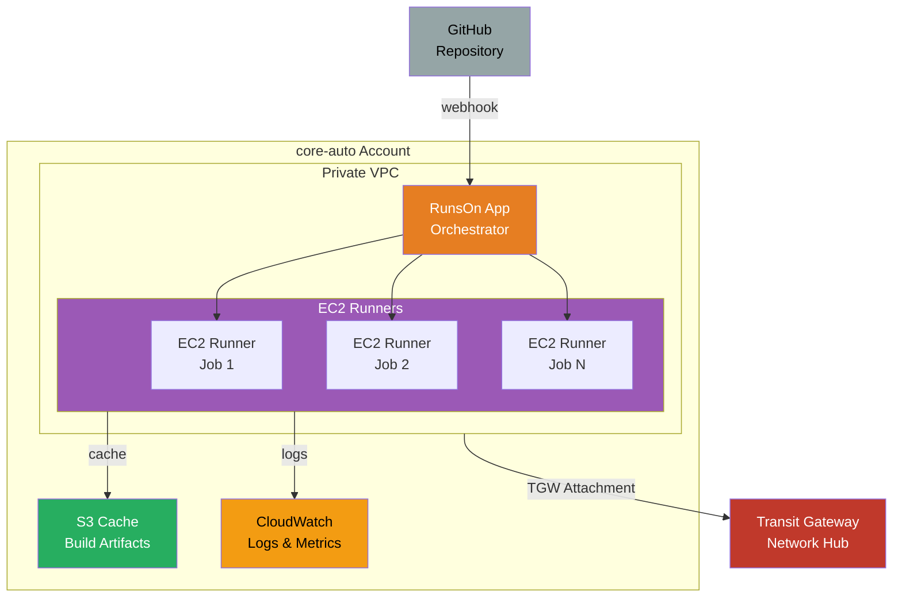

# Self-Hosted Runners

Self-hosted GitHub Actions runners on EC2 via runs-on.com for jobs requiring private network access (database migrations, Terraform) through Transit Gateway.

## Problems this Architecture solves

- Enables CI/CD jobs that must reach private infrastructure and internal services not accessible from hosted runners.
- Avoids keeping long-lived build workers running all the time by scaling runners up only when jobs exist.
- Centralizes caching, logging, and operational visibility for privileged automation workloads.



## Key Features

- **Private Network Access**: Runners in VPC can access RDS, ElastiCache via Transit Gateway
- **Auto-Scaling**: Spin up runners on-demand, terminate when idle
- **Cost Optimization**: Only pay for runners when jobs are running
- **S3 Caching**: Cache dependencies and build artifacts
- **CloudWatch Logs**: Centralized logging for all runner activity
- **Spot Instances**: Use spot instances for cost savings

## Use Cases

### Database Migrations
- Connect to RDS in private subnets
- Run migrations via Flyway or Liquibase
- No public internet exposure

### Terraform Deployments
- Access AWS APIs via VPC endpoints
- Deploy infrastructure changes
- State stored in S3 with DynamoDB locking

### Integration Tests
- Test against real databases and services
- Access internal APIs
- Run E2E tests in isolated environment

## RunsOn Configuration

### Instance Types
- **t3.medium**: General-purpose jobs (2 vCPU, 4 GB)
- **c6i.xlarge**: CPU-intensive builds (4 vCPU, 8 GB)
- **r6i.large**: Memory-intensive tests (2 vCPU, 16 GB)

### Auto-Scaling
- **Min**: 0 runners (scale to zero when idle)
- **Max**: 20 runners (burst capacity)
- **Scale-up**: 30 seconds to provision new runner
- **Scale-down**: 5 minutes idle timeout

## GitHub Actions Workflow

```yaml
jobs:
  deploy:
    runs-on: runs-on,runner=2cpu-linux-x64
    steps:
      - uses: actions/checkout@v4
      - name: Run Terraform
        run: terraform apply -auto-approve
```
