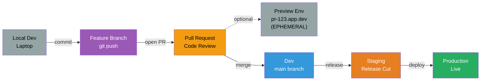

# Developer Workflow

From local development to production with CI/CD automation.

## Problems this Architecture solves

- Clarifies how code moves from local development to production with explicit promotion stages.
- Reduces manual release coordination by making testing, review, and deployment gates repeatable.
- Creates earlier feedback loops through pull requests, preview environments, and environment-specific validation.

## Pipeline Stages

### 1. Local Development
- Developer writes code on laptop
- Run tests locally with `npm test` or `pytest`
- Commit changes to feature branch

### 2. Feature Branch
- Push branch to GitHub
- CI runs automated tests
- Linting, type checking, security scans

### 3. Pull Request
- Open PR for code review
- Required approvals from team
- CI checks must pass
- Optional: Deploy preview environment

### 4. Preview Environment (Optional)
- Ephemeral environment per PR
- URL: `pr-123.app.dev`
- Automatically destroyed when PR closes
- Full stack deployment for testing

### 5. Dev Environment
- Merge to `main` branch
- Automatic deployment to dev account
- Integration tests run
- Smoke tests verify deployment

### 6. Staging Environment
- Create release tag or branch
- Deploy to staging for QA validation
- Load testing and performance testing
- Manual approval gate

### 7. Production
- Deploy to production after approval
- Blue-green or canary deployment
- Automated rollback on failure
- Post-deployment verification

## Key Features

- **Automated Testing**: Unit, integration, and E2E tests at each stage
- **Preview Environments**: Test changes in isolation before merge
- **Manual Approval Gates**: Require approval for staging and prod
- **Automated Rollback**: Revert to previous version on failure
- **Deployment Strategies**: Blue-green, canary, rolling updates
