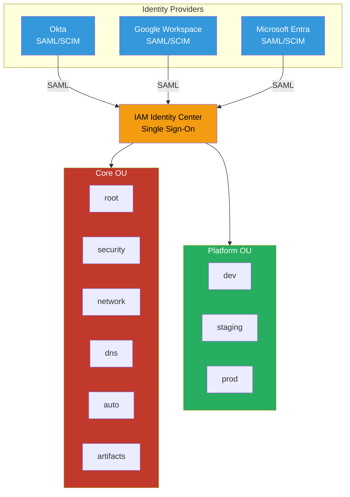
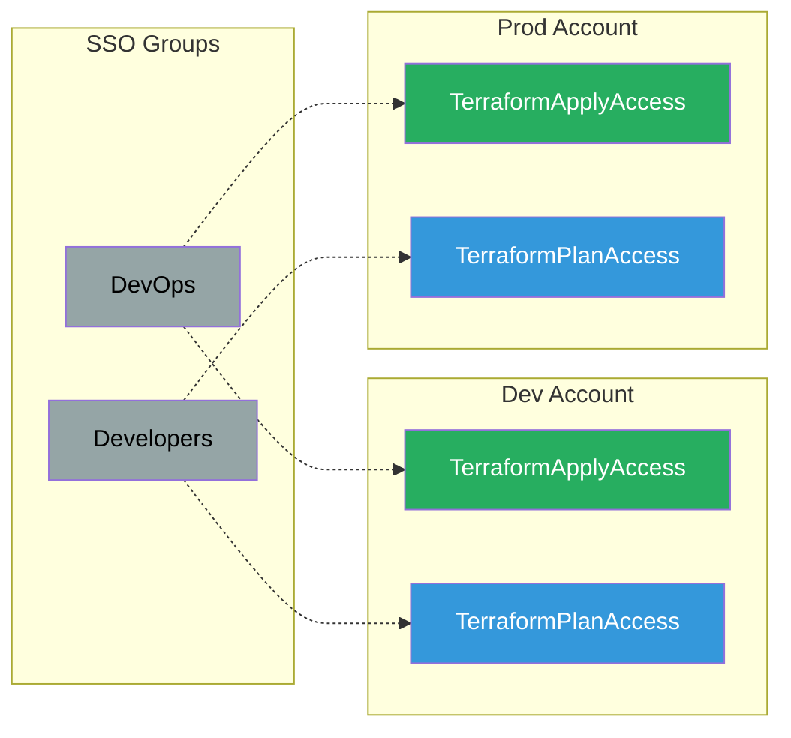
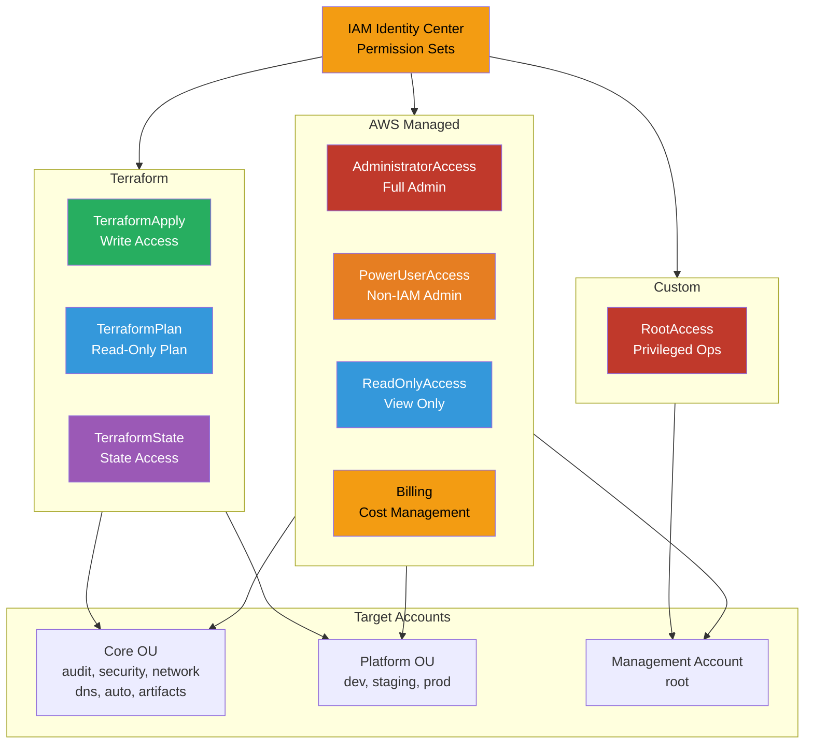

# Users and Permissions

Federated access with AWS IAM Identity Center (SSO) and fine-grained permission sets.
This design connects an external identity provider to AWS so users authenticate once and receive the right level of access across every account. It turns group membership and permission sets into the primary control model, which keeps access consistent as environments and teams grow.

## Problems this Architecture solves

- Removes the need for long-lived IAM users and scattered account-by-account credentials.
- Standardizes how teams get access across environments with group-based, least-privilege permissions.
- Makes onboarding, offboarding, and permission changes easier to control from one identity plane.

## Identity Federation

Centrally managed users via IAM Identity Center, integrated with your IdP of choice (Okta, Google Workspace, Microsoft Entra, etc.)

### Key Features

- **SAML 2.0 Federation**: Integrate with any SAML-compatible IdP
- **SCIM Provisioning**: Automatic user/group sync from IdP to AWS
- **Single Sign-On**: One login for all AWS accounts
- **MFA Enforcement**: Require MFA at IdP level
- **Session Duration**: Configurable session timeout (1-12 hours)
- **No IAM Users**: All access via SSO, including root account

### Supported Identity Providers

- Okta
- Google Workspace
- Microsoft Entra ID (Azure AD)
- JumpCloud
- OneLogin
- Any SAML 2.0 compatible IdP

### Authentication Flow

1. User navigates to AWS access portal
2. Redirected to IdP for authentication
3. User enters credentials + MFA
4. IdP returns SAML assertion to AWS
5. IAM Identity Center validates assertion
6. User selects account and permission set
7. Temporary credentials issued (AssumeRoleWithSAML)

## Group Mapping

IdP groups mapped to SSO permission sets across AWS accounts for role-based access control.

### Key Features

- **Group-Based Access**: Assign permissions via IdP groups
- **Automatic Sync**: SCIM keeps groups in sync
- **Least Privilege**: Developers get read-only in prod
- **Separation of Duties**: Different permissions per environment

### Example Mappings

#### DevOps Team

- **Dev Account**: TerraformApplyAccess (write)
- **Prod Account**: TerraformApplyAccess (write)
- **Purpose**: Full infrastructure management

#### Developers

- **Dev Account**: TerraformPlanAccess (read-only)
- **Prod Account**: TerraformPlanAccess (read-only)
- **Purpose**: View infrastructure, no changes

#### Platform Team

- **All Accounts**: AdministratorAccess
- **Purpose**: Full AWS console access

#### Security Team

- **core-security**: AdministratorAccess
- **All Accounts**: ReadOnlyAccess + SecurityAudit
- **Purpose**: Security monitoring and incident response

## Permission Sets

Least-privilege access with custom and AWS-managed permission sets for fine-grained control.

### AWS Managed Permission Sets

#### AdministratorAccess

- **Policy**: `arn:aws:iam::aws:policy/AdministratorAccess`
- **Use Case**: Platform team, emergency access
- **Permissions**: Full access to all AWS services

#### PowerUserAccess

- **Policy**: `arn:aws:iam::aws:policy/PowerUserAccess`
- **Use Case**: Developers needing broad access without IAM changes
- **Permissions**: All services except IAM and Organizations

#### ReadOnlyAccess

- **Policy**: `arn:aws:iam::aws:policy/ReadOnlyAccess`
- **Use Case**: Auditors, support staff, read-only access
- **Permissions**: Read-only access to all services

#### Billing

- **Policy**: `arn:aws:iam::aws:policy/job-function/Billing`
- **Use Case**: Finance team, cost management
- **Permissions**: View and manage billing, Cost Explorer, Budgets

### Terraform Permission Sets

#### TerraformApply

- **Permissions**: Full Terraform operations (plan, apply, destroy)
- **Use Case**: CI/CD pipelines, DevOps team
- **Includes**: EC2, VPC, RDS, S3, IAM (limited), etc.

#### TerraformPlan

- **Permissions**: Read-only Terraform plan operations
- **Use Case**: Developers reviewing infrastructure changes
- **Includes**: Describe/List operations only

#### TerraformState

- **Permissions**: S3 state file access, DynamoDB locking
- **Use Case**: Terraform backend operations
- **Includes**: S3 GetObject/PutObject, DynamoDB GetItem/PutItem

### Custom Permission Sets

#### RootAccess

- **Permissions**: Privileged operations requiring root account
- **Use Case**: Account closure, support plan changes, MFA reset
- **Includes**: Organizations management, billing configuration

### Key Features

- **No IAM Users**: All access via SSO-based permission sets
- **Service Control Policies**: SCPs enforce guardrails at OU level
- **Session Duration**: 1-12 hours configurable per permission set
- **MFA Requirement**: Can enforce MFA for sensitive permission sets
- **Permission Boundaries**: Limit maximum permissions for delegated admin
