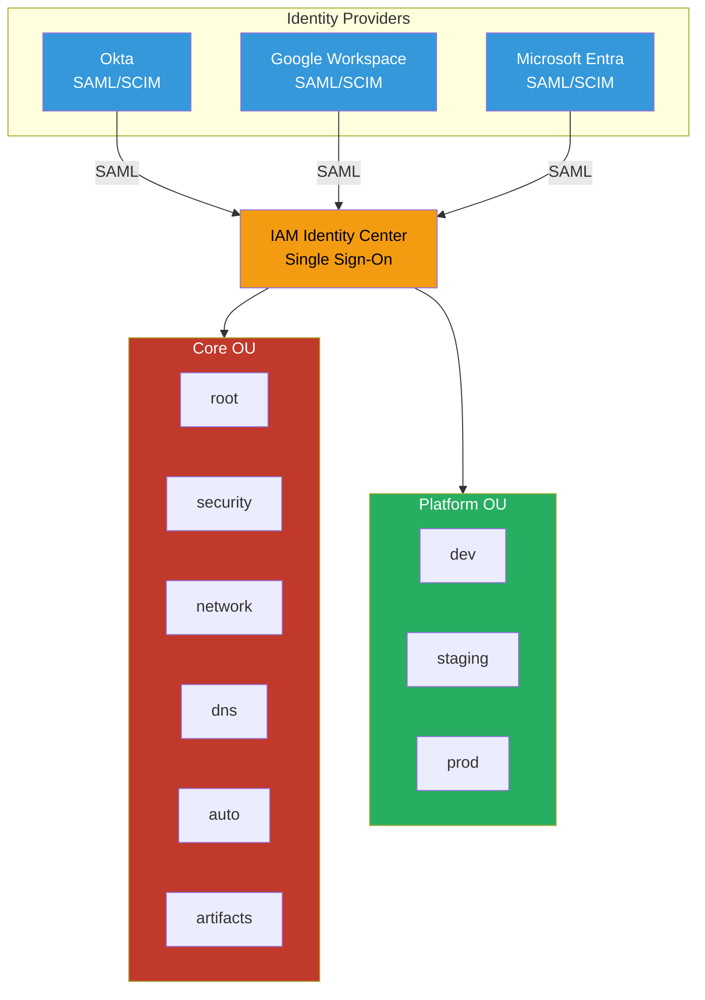

# Identity Federation

Centrally managed users via IAM Identity Center, integrated with your IdP of choice (Okta, Google Workspace, Microsoft Entra, etc.)

## Key Features

- **SAML 2.0 Federation**: Integrate with any SAML-compatible IdP
- **SCIM Provisioning**: Automatic user/group sync from IdP to AWS
- **Single Sign-On**: One login for all AWS accounts
- **MFA Enforcement**: Require MFA at IdP level
- **Session Duration**: Configurable session timeout (1-12 hours)
- **No IAM Users**: All access via SSO, including root account

## Supported Identity Providers

- Okta
- Google Workspace
- Microsoft Entra ID (Azure AD)
- JumpCloud
- OneLogin
- Any SAML 2.0 compatible IdP

## Authentication Flow

1. User navigates to AWS access portal
2. Redirected to IdP for authentication
3. User enters credentials + MFA
4. IdP returns SAML assertion to AWS
5. IAM Identity Center validates assertion
6. User selects account and permission set
7. Temporary credentials issued (AssumeRoleWithSAML)
