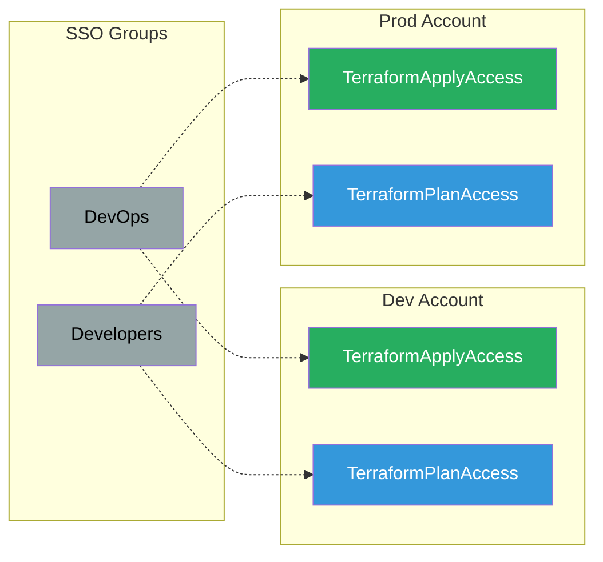

# Group Mapping

IdP groups mapped to SSO permission sets across AWS accounts for role-based access control.

## Key Features

- **Group-Based Access**: Assign permissions via IdP groups
- **Automatic Sync**: SCIM keeps groups in sync
- **Least Privilege**: Developers get read-only in prod
- **Separation of Duties**: Different permissions per environment

## Example Mappings

### DevOps Team
- **Dev Account**: TerraformApplyAccess (write)
- **Prod Account**: TerraformApplyAccess (write)
- **Purpose**: Full infrastructure management

### Developers
- **Dev Account**: TerraformPlanAccess (read-only)
- **Prod Account**: TerraformPlanAccess (read-only)
- **Purpose**: View infrastructure, no changes

### Platform Team
- **All Accounts**: AdministratorAccess
- **Purpose**: Full AWS console access

### Security Team
- **core-security**: AdministratorAccess
- **All Accounts**: ReadOnlyAccess + SecurityAudit
- **Purpose**: Security monitoring and incident response
