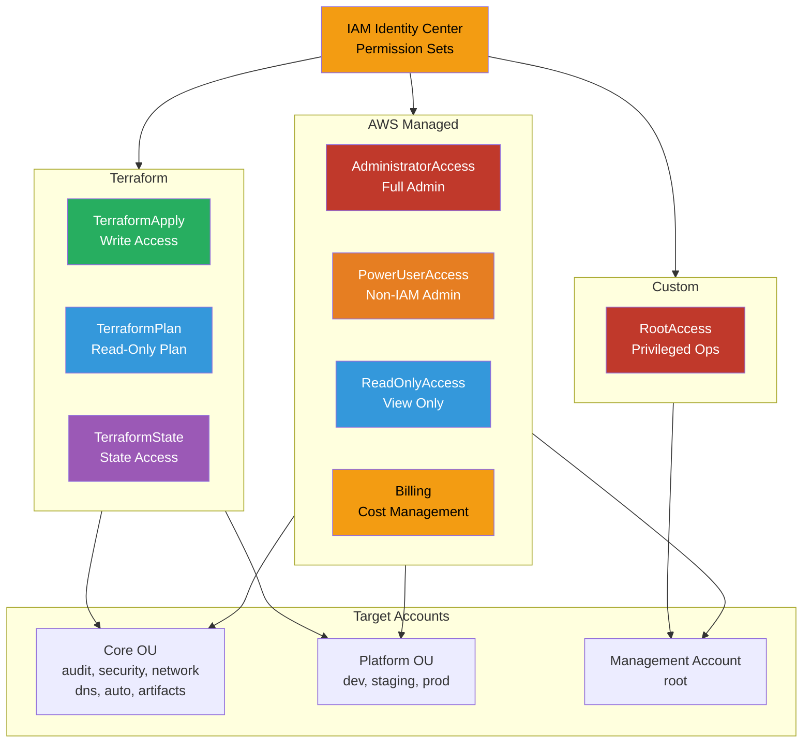

# Permission Sets

Least-privilege access with custom and AWS-managed permission sets for fine-grained control.

## AWS Managed Permission Sets

### AdministratorAccess
- **Policy**: arn:aws:iam::aws:policy/AdministratorAccess
- **Use Case**: Platform team, emergency access
- **Permissions**: Full access to all AWS services

### PowerUserAccess
- **Policy**: arn:aws:iam::aws:policy/PowerUserAccess
- **Use Case**: Developers needing broad access without IAM changes
- **Permissions**: All services except IAM and Organizations

### ReadOnlyAccess
- **Policy**: arn:aws:iam::aws:policy/ReadOnlyAccess
- **Use Case**: Auditors, support staff, read-only access
- **Permissions**: Read-only access to all services

### Billing
- **Policy**: arn:aws:iam::aws:policy/job-function/Billing
- **Use Case**: Finance team, cost management
- **Permissions**: View and manage billing, Cost Explorer, Budgets

## Terraform Permission Sets

### TerraformApply
- **Permissions**: Full Terraform operations (plan, apply, destroy)
- **Use Case**: CI/CD pipelines, DevOps team
- **Includes**: EC2, VPC, RDS, S3, IAM (limited), etc.

### TerraformPlan
- **Permissions**: Read-only Terraform plan operations
- **Use Case**: Developers reviewing infrastructure changes
- **Includes**: Describe/List operations only

### TerraformState
- **Permissions**: S3 state file access, DynamoDB locking
- **Use Case**: Terraform backend operations
- **Includes**: S3 GetObject/PutObject, DynamoDB GetItem/PutItem

## Custom Permission Sets

### RootAccess
- **Permissions**: Privileged operations requiring root account
- **Use Case**: Account closure, support plan changes, MFA reset
- **Includes**: Organizations management, billing configuration

## Key Features

- **No IAM Users**: All access via SSO-based permission sets
- **Service Control Policies**: SCPs enforce guardrails at OU level
- **Session Duration**: 1-12 hours configurable per permission set
- **MFA Requirement**: Can enforce MFA for sensitive permission sets
- **Permission Boundaries**: Limit maximum permissions for delegated admin
