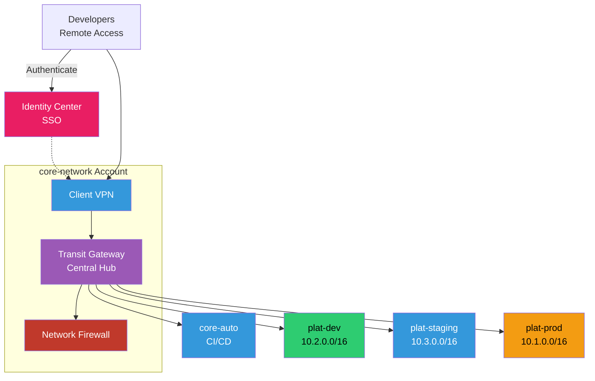
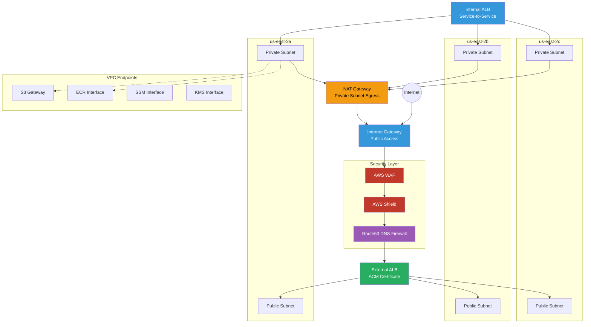
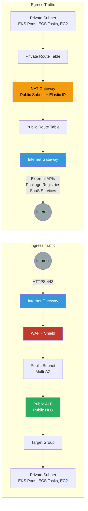
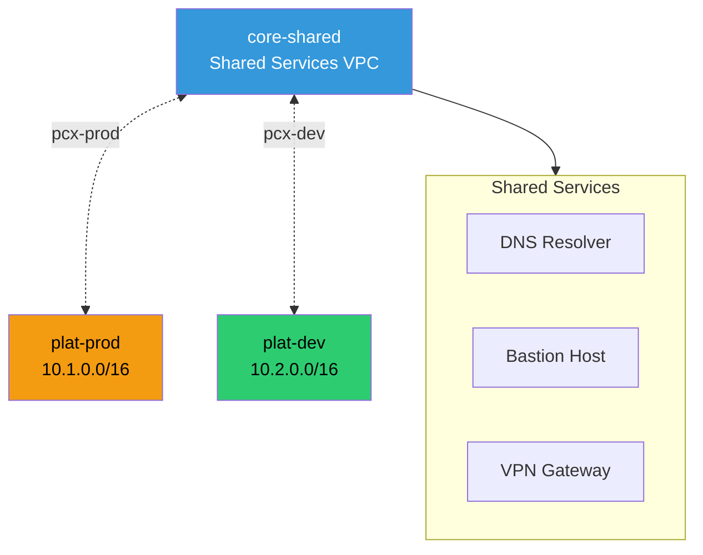
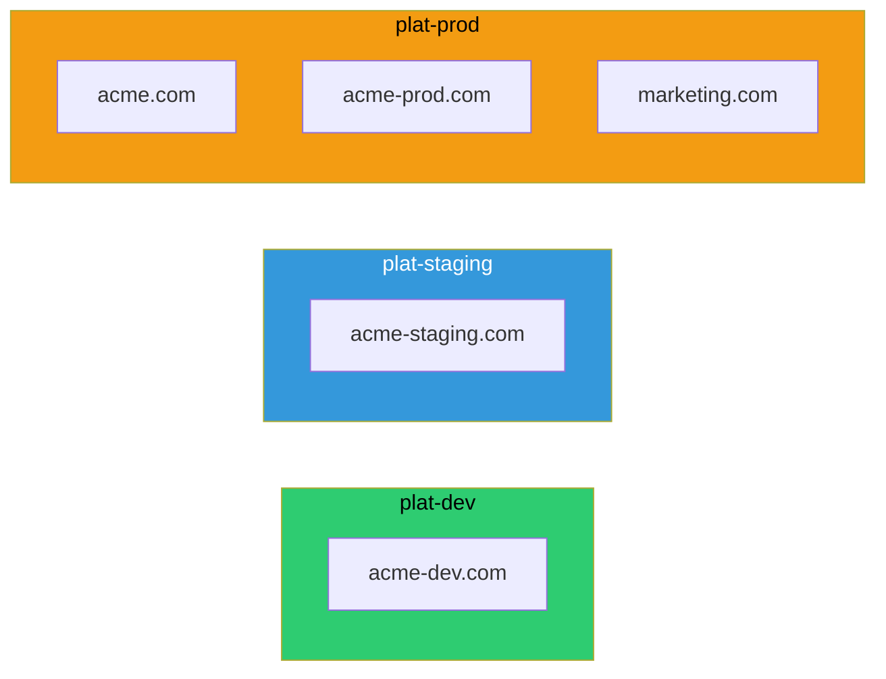
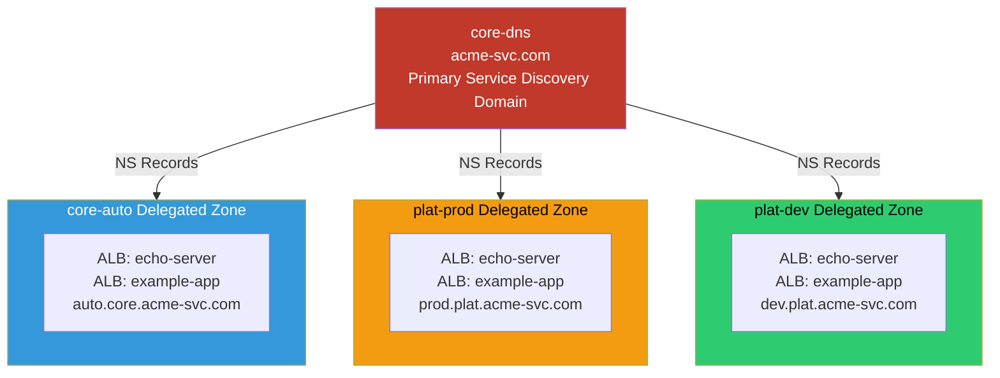

# Network and DNS

Hub-and-spoke VPC design with Transit Gateway, DNS architecture, and centralized network firewall inspection.
This network layer defines how environments connect, how traffic enters and exits, and how DNS is managed across accounts. It gives teams a repeatable pattern for shared connectivity, public domains, internal service discovery, and controlled remote access without inventing a different network model per workload.

## Problems this Architecture solves

- Replaces ad hoc VPC connectivity with a predictable routing model across environments and shared services.
- Reduces exposure by keeping workloads in private networks while standardizing ingress, egress, and remote access.
- Establishes a consistent DNS strategy for public domains, internal discovery, and cross-account communication.

## Transit Gateway

Hub-and-spoke architecture with centralized routing through Transit Gateway. Optional network firewall and remote access with AWS Client VPN integrated with Identity Center.



### Key Features

- **Transit Gateway**: Central hub for all VPC connectivity with route tables per environment
- **Network Firewall**: Stateful inspection and IDS/IPS for east-west traffic
- **Client VPN**: Remote access for developers authenticated via Identity Center
- **Route Tables**: Separate routing domains for dev, staging, and prod isolation
- **VPC Attachments**: Each VPC attaches to TGW with specific route propagation
- **Centralized Egress**: Optional centralized NAT/firewall for internet-bound traffic

### Routing Strategy

- **Development**: Full access to dev and staging VPCs, no access to prod
- **Staging**: Access to staging VPC only, isolated from dev and prod
- **Production**: Isolated from all other environments
- **Shared Services**: `core-auto` accessible from all environments for CI/CD

### Network Firewall Rules

- **Stateful Rules**: Allow/deny based on 5-tuple (src IP, dst IP, src port, dst port, protocol)
- **Domain Filtering**: Block access to malicious domains
- **IDS/IPS**: Suricata-compatible rules for threat detection
- **Logging**: All traffic logged to CloudWatch and S3 for analysis

## Platform VPC

Per-account VPC architecture with multi-AZ subnets, load balancers, and VPC endpoints.



### Key Features

- **Multi-AZ**: 3 availability zones for high availability (`us-east-2a`, `2b`, `2c`)
- **Public Subnets**: Host NAT Gateways and public-facing load balancers
- **Private Subnets**: Host application workloads (ECS, EKS, Lambda)
- **Internet Gateway**: Public internet access for external ALB
- **NAT Gateway**: Outbound internet access for private subnets
- **VPC Endpoints**: Private connectivity to AWS services without internet traversal

### CIDR Allocation

- **plat-prod**: `10.1.0.0/16`
- **plat-dev**: `10.2.0.0/16`
- **plat-staging**: `10.3.0.0/16`

### Load Balancers

#### External ALB

- **Purpose**: Public-facing HTTPS traffic
- **Subnets**: Public subnets in all 3 AZs
- **Security**: WAF + Shield + ACM certificate
- **Targets**: ECS tasks, EKS pods, Lambda functions

#### Internal ALB

- **Purpose**: Service-to-service communication
- **Subnets**: Private subnets in all 3 AZs
- **Security**: Security groups only
- **Targets**: Internal microservices

### VPC Endpoints

- **S3 Gateway**: Free, no data transfer charges
- **ECR (dkr, api)**: Pull container images privately
- **SSM**: Systems Manager access without internet
- **Secrets Manager**: Retrieve secrets privately
- **KMS**: Encryption operations
- **SQS/SNS**: Messaging services
- **EC2 Messages**: SSM Session Manager

## Traffic Flow

Traffic flow patterns for inbound requests via ALB/NLB and outbound traffic via NAT Gateway.



### Ingress Flow

#### 1. Internet to Internet Gateway

- Public IPv4 traffic enters VPC via IGW
- IGW performs 1:1 NAT for Elastic IPs

#### 2. Internet Gateway to WAF and Shield

- WAF inspects HTTP/HTTPS requests
- Shield provides DDoS protection
- Rate limiting and geo-blocking applied

#### 3. WAF to Public Subnet

- Traffic routed to public subnets across multiple AZs
- Load balancer distributes traffic

#### 4. Public ALB or NLB to Target Group

- ALB: Layer 7 load balancing with path-based routing
- NLB: Layer 4 load balancing for TCP/UDP
- Health checks ensure only healthy targets receive traffic

#### 5. Target Group to Private Subnet

- Traffic forwarded to ECS tasks, EKS pods, or EC2 instances
- Security groups control access
- Application processes request and returns response

### Egress Flow

#### 1. Private Subnet to Private Route Table

- Workloads initiate outbound connections
- Default route (`0.0.0.0/0`) points to NAT Gateway

#### 2. Private Route Table to NAT Gateway

- NAT Gateway in public subnet
- Source NAT applied (private IP to Elastic IP)
- Stateful connection tracking

#### 3. NAT Gateway to Public Route Table

- Public route table routes to Internet Gateway
- Elastic IP maintained for return traffic

#### 4. Public Route Table to Internet Gateway

- IGW forwards traffic to internet
- Return traffic routed back via stateful NAT

#### 5. Internet Gateway to Internet

- Access external APIs (Stripe, Twilio, etc.)
- Pull packages from registries (npm, PyPI, Docker Hub)
- Connect to SaaS services (Datadog, PagerDuty, etc.)

### Key Features

- **Ingress**: ALB/NLB in public subnets, workloads in private subnets
- **Egress**: NAT Gateway for outbound internet access from private subnets
- **Security**: WAF and Shield protect ingress, security groups control egress
- **High Availability**: Multi-AZ deployment for both ingress and egress paths

## VPC Peering

Direct VPC-to-VPC connectivity for simpler topologies without Transit Gateway.



### Key Features

- **Direct Connectivity**: Low-latency, high-bandwidth connection between VPCs
- **Non-Transitive**: Each VPC pair requires separate peering connection
- **No Single Point of Failure**: Peering connections are redundant and fault-tolerant
- **Cost-Effective**: Lower cost than Transit Gateway for simple topologies
- **Security Groups**: Can reference security groups across peered VPCs

### Use Cases

#### Shared Services Access

- DNS resolution via Route 53 Resolver endpoints
- Bastion host access for SSH/RDP
- VPN Gateway for site-to-site connectivity

#### Cross-Account Peering

- Peer VPCs across different AWS accounts
- Requires acceptance from both sides
- IAM permissions needed for peering creation

### Limitations

- **Non-Transitive**: VPC A cannot reach VPC C through VPC B
- **CIDR Overlap**: Peered VPCs cannot have overlapping CIDR blocks
- **Route Table Updates**: Manual route table updates required for each peering
- **Scalability**: Complex mesh topology with many VPCs

### When to Use Transit Gateway Instead

- More than 3-4 VPCs need connectivity
- Centralized routing and firewall inspection required
- Need transitive routing between VPCs
- Simplified route table management desired

## Vanity Domains

Customer-facing branded domains owned by each SDLC environment.



### Key Features

- **Environment-Specific**: Each environment owns its vanity domain zones with ACM certificates
- **ACM Certificates**: Wildcard certificates for each domain (`*.acme.com`, `*.acme-dev.com`)
- **Route 53 Hosted Zones**: Public zones for customer-facing domains
- **Alias Records**: Point to ALB/CloudFront distributions
- **Health Checks**: Monitor endpoint availability

### Domain Strategy

#### Development (`plat-dev`)

- **acme-dev.com**: Development environment for testing
- **Purpose**: Feature branch deployments and developer testing
- **Certificate**: `*.acme-dev.com` wildcard

#### Staging (`plat-staging`)

- **acme-staging.com**: Pre-production environment
- **Purpose**: QA validation and release candidate testing
- **Certificate**: `*.acme-staging.com` wildcard

#### Production (`plat-prod`)

- **acme.com**: Primary production domain
- **acme-prod.com**: Alternative production domain
- **marketing.com**: Marketing site domain
- **Certificates**: `*.acme.com`, `*.acme-prod.com`, `*.marketing.com` wildcards

### DNS Records

#### Typical Setup

```text
acme.com                    A    ALIAS -> ALB
www.acme.com                A    ALIAS -> ALB
api.acme.com                A    ALIAS -> ALB
*.acme.com                  A    ALIAS -> CloudFront
```

### Certificate Management

- **ACM**: Automated certificate provisioning and renewal
- **DNS Validation**: CNAME records for domain ownership verification
- **Wildcard Certs**: Cover all subdomains (`*.acme.com`)
- **Multi-Domain**: Single cert can cover multiple domains (SAN)

## Service Discovery

Internal DNS with delegated zones from `core-dns` to member accounts.



### Example FQDNs

- `echo-server.use2.auto.core.acme-svc.com`
- `echo-server.use2.prod.plat.acme-svc.com`
- `example-app.use2.dev.plat.acme-svc.com`

### Key Features

- **Centralized DNS**: `core-dns` account owns the primary service discovery domain
- **Delegated Zones**: Each account manages its own subdomain via NS records
- **Automatic Registration**: ALB/NLB automatically register with Route 53
- **Health Checks**: DNS queries only return healthy endpoints
- **Multi-Region**: Region identifier in FQDN (`use2 = us-east-2`)

### DNS Hierarchy

```text
acme-svc.com (core-dns)
|- auto.core.acme-svc.com (core-auto)
|  |- echo-server.use2.auto.core.acme-svc.com
|  `- example-app.use2.auto.core.acme-svc.com
|- prod.plat.acme-svc.com (plat-prod)
|  |- echo-server.use2.prod.plat.acme-svc.com
|  `- example-app.use2.prod.plat.acme-svc.com
`- dev.plat.acme-svc.com (plat-dev)
   |- echo-server.use2.dev.plat.acme-svc.com
   `- example-app.use2.dev.plat.acme-svc.com
```

### Delegation Setup

#### core-dns Account

```text
acme-svc.com                NS    ns-1234.awsdns-12.org
auto.core.acme-svc.com      NS    ns-5678.awsdns-34.com (core-auto)
prod.plat.acme-svc.com      NS    ns-9012.awsdns-56.net (plat-prod)
dev.plat.acme-svc.com       NS    ns-3456.awsdns-78.org (plat-dev)
```

#### Member Accounts

Each account creates `A` or `ALIAS` records in its delegated zone:

```text
echo-server.use2.auto.core.acme-svc.com    A    ALIAS -> ALB
example-app.use2.auto.core.acme-svc.com    A    ALIAS -> ALB
```

### Use Cases

- **Service-to-Service**: Microservices discover each other via DNS
- **Cross-Account**: Services in different accounts can communicate
- **Environment Isolation**: Dev/staging/prod have separate namespaces
- **Load Balancing**: DNS returns multiple IPs for load distribution
