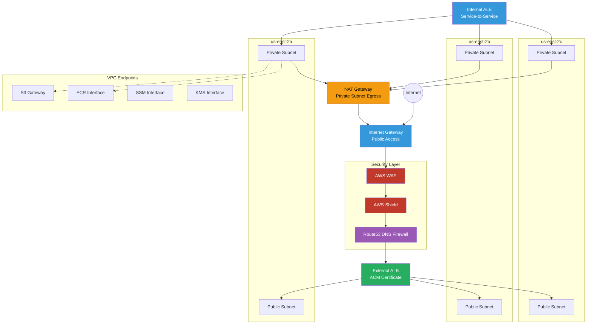

# Platform Account VPC

Per-account VPC architecture with multi-AZ subnets, load balancers, and VPC endpoints.

## Key Features

- **Multi-AZ**: 3 availability zones for high availability (us-east-2a, 2b, 2c)
- **Public Subnets**: Host NAT Gateways and public-facing load balancers
- **Private Subnets**: Host application workloads (ECS, EKS, Lambda)
- **Internet Gateway**: Public internet access for external ALB
- **NAT Gateway**: Outbound internet access for private subnets
- **VPC Endpoints**: Private connectivity to AWS services without internet traversal

## CIDR Allocation

- **plat-prod**: 10.1.0.0/16
- **plat-dev**: 10.2.0.0/16
- **plat-staging**: 10.3.0.0/16

## Load Balancers

### External ALB
- **Purpose**: Public-facing HTTPS traffic
- **Subnets**: Public subnets in all 3 AZs
- **Security**: WAF + Shield + ACM certificate
- **Targets**: ECS tasks, EKS pods, Lambda functions

### Internal ALB
- **Purpose**: Service-to-service communication
- **Subnets**: Private subnets in all 3 AZs
- **Security**: Security groups only
- **Targets**: Internal microservices

## VPC Endpoints

- **S3 Gateway**: Free, no data transfer charges
- **ECR (dkr, api)**: Pull container images privately
- **SSM**: Systems Manager access without internet
- **Secrets Manager**: Retrieve secrets privately
- **KMS**: Encryption operations
- **SQS/SNS**: Messaging services
- **EC2 Messages**: SSM Session Manager
