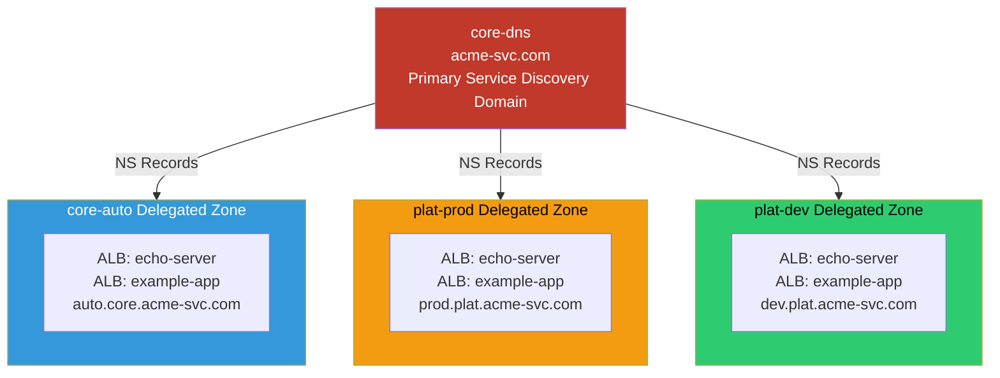

# Service Discovery

Internal DNS with delegated zones from core-dns to member accounts.



## Example FQDNs

- `echo-server.use2.auto.core.acme-svc.com`
- `echo-server.use2.prod.plat.acme-svc.com`
- `example-app.use2.dev.plat.acme-svc.com`

## Key Features

- **Centralized DNS**: core-dns account owns primary service discovery domain
- **Delegated Zones**: Each account manages its own subdomain via NS records
- **Automatic Registration**: ALB/NLB automatically register with Route 53
- **Health Checks**: DNS queries only return healthy endpoints
- **Multi-Region**: Region identifier in FQDN (use2 = us-east-2)

## DNS Hierarchy

```
acme-svc.com (core-dns)
├── auto.core.acme-svc.com (core-auto)
│   ├── echo-server.use2.auto.core.acme-svc.com
│   └── example-app.use2.auto.core.acme-svc.com
├── prod.plat.acme-svc.com (plat-prod)
│   ├── echo-server.use2.prod.plat.acme-svc.com
│   └── example-app.use2.prod.plat.acme-svc.com
└── dev.plat.acme-svc.com (plat-dev)
    ├── echo-server.use2.dev.plat.acme-svc.com
    └── example-app.use2.dev.plat.acme-svc.com
```

## Delegation Setup

### core-dns Account
```
acme-svc.com                NS    ns-1234.awsdns-12.org
auto.core.acme-svc.com      NS    ns-5678.awsdns-34.com (core-auto)
prod.plat.acme-svc.com      NS    ns-9012.awsdns-56.net (plat-prod)
dev.plat.acme-svc.com       NS    ns-3456.awsdns-78.org (plat-dev)
```

### Member Accounts
Each account creates A/ALIAS records in their delegated zone:
```
echo-server.use2.auto.core.acme-svc.com    A    ALIAS → ALB
example-app.use2.auto.core.acme-svc.com    A    ALIAS → ALB
```

## Use Cases

- **Service-to-Service**: Microservices discover each other via DNS
- **Cross-Account**: Services in different accounts can communicate
- **Environment Isolation**: Dev/staging/prod have separate namespaces
- **Load Balancing**: DNS returns multiple IPs for load distribution
