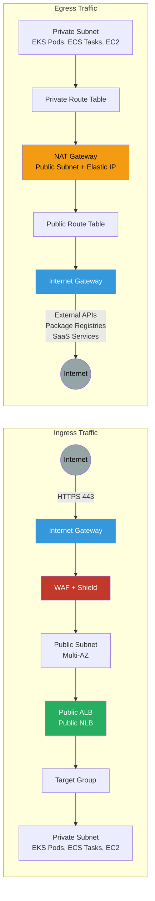

# Ingress/Egress Traffic Flow

Traffic flow patterns for inbound requests via ALB/NLB and outbound traffic via NAT Gateway.

## Ingress Flow

### 1. Internet → Internet Gateway
- Public IPv4 traffic enters VPC via IGW
- IGW performs 1:1 NAT for Elastic IPs

### 2. Internet Gateway → WAF + Shield
- WAF inspects HTTP/HTTPS requests
- Shield provides DDoS protection
- Rate limiting and geo-blocking applied

### 3. WAF → Public Subnet
- Traffic routed to public subnets across multiple AZs
- Load balancer distributes traffic

### 4. Public ALB/NLB → Target Group
- ALB: Layer 7 load balancing with path-based routing
- NLB: Layer 4 load balancing for TCP/UDP
- Health checks ensure only healthy targets receive traffic

### 5. Target Group → Private Subnet
- Traffic forwarded to ECS tasks, EKS pods, or EC2 instances
- Security groups control access
- Application processes request and returns response

## Egress Flow

### 1. Private Subnet → Private Route Table
- Workloads initiate outbound connections
- Default route (0.0.0.0/0) points to NAT Gateway

### 2. Private Route Table → NAT Gateway
- NAT Gateway in public subnet
- Source NAT applied (private IP → Elastic IP)
- Stateful connection tracking

### 3. NAT Gateway → Public Route Table
- Public route table routes to Internet Gateway
- Elastic IP maintained for return traffic

### 4. Public Route Table → Internet Gateway
- IGW forwards traffic to internet
- Return traffic routed back via stateful NAT

### 5. Internet Gateway → Internet
- Access external APIs (Stripe, Twilio, etc.)
- Pull packages from registries (npm, PyPI, Docker Hub)
- Connect to SaaS services (Datadog, PagerDuty, etc.)

## Key Features

- **Ingress**: ALB/NLB in public subnets, workloads in private subnets
- **Egress**: NAT Gateway for outbound internet access from private subnets
- **Security**: WAF and Shield protect ingress, security groups control egress
- **High Availability**: Multi-AZ deployment for both ingress and egress paths
