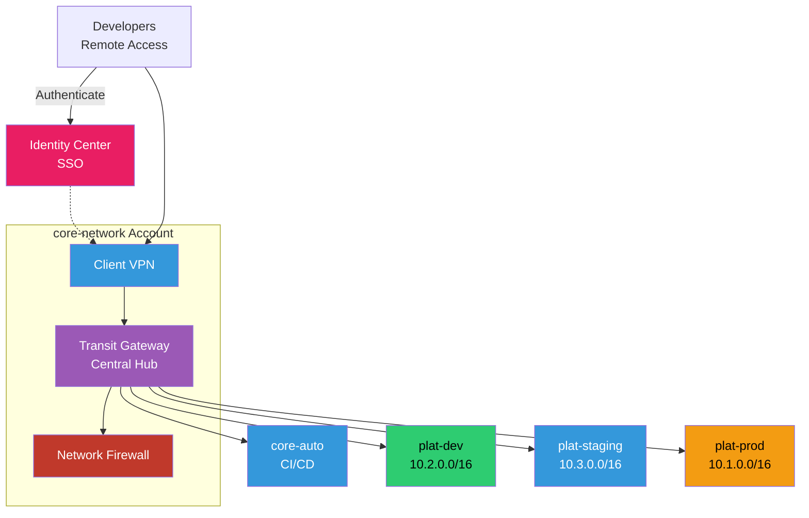

# Transit Gateway Architecture

Hub-and-spoke architecture with centralized routing through Transit Gateway. Optional network firewall and remote access with AWS Client VPN integrated with Identity Center.

## Key Features

- **Transit Gateway**: Central hub for all VPC connectivity with route tables per environment
- **Network Firewall**: Stateful inspection and IDS/IPS for east-west traffic
- **Client VPN**: Remote access for developers authenticated via Identity Center
- **Route Tables**: Separate routing domains for dev, staging, and prod isolation
- **VPC Attachments**: Each VPC attaches to TGW with specific route propagation
- **Centralized Egress**: Optional centralized NAT/firewall for internet-bound traffic

## Routing Strategy

- **Development**: Full access to dev and staging VPCs, no access to prod
- **Staging**: Access to staging VPC only, isolated from dev and prod
- **Production**: Isolated from all other environments
- **Shared Services**: core-auto accessible from all environments for CI/CD

## Network Firewall Rules

- **Stateful Rules**: Allow/deny based on 5-tuple (src IP, dst IP, src port, dst port, protocol)
- **Domain Filtering**: Block access to malicious domains
- **IDS/IPS**: Suricata-compatible rules for threat detection
- **Logging**: All traffic logged to CloudWatch and S3 for analysis
