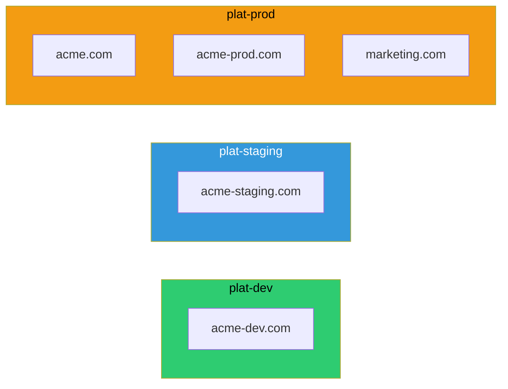

# Vanity Domains

Customer-facing branded domains owned by each SDLC environment.



## Key Features

- **Environment-Specific**: Each environment owns its vanity domain zones with ACM certificates
- **ACM Certificates**: Wildcard certificates for each domain (*.acme.com, *.acme-dev.com)
- **Route 53 Hosted Zones**: Public zones for customer-facing domains
- **Alias Records**: Point to ALB/CloudFront distributions
- **Health Checks**: Monitor endpoint availability

## Domain Strategy

### Development (plat-dev)
- **acme-dev.com**: Development environment for testing
- **Purpose**: Feature branch deployments and developer testing
- **Certificate**: *.acme-dev.com wildcard

### Staging (plat-staging)
- **acme-staging.com**: Pre-production environment
- **Purpose**: QA validation and release candidate testing
- **Certificate**: *.acme-staging.com wildcard

### Production (plat-prod)
- **acme.com**: Primary production domain
- **acme-prod.com**: Alternative production domain
- **marketing.com**: Marketing site domain
- **Certificates**: *.acme.com, *.acme-prod.com, *.marketing.com wildcards

## DNS Records

### Typical Setup
```
acme.com                    A    ALIAS → ALB
www.acme.com                A    ALIAS → ALB
api.acme.com                A    ALIAS → ALB
*.acme.com                  A    ALIAS → CloudFront
```

## Certificate Management

- **ACM**: Automated certificate provisioning and renewal
- **DNS Validation**: CNAME records for domain ownership verification
- **Wildcard Certs**: Cover all subdomains (*.acme.com)
- **Multi-Domain**: Single cert can cover multiple domains (SAN)
