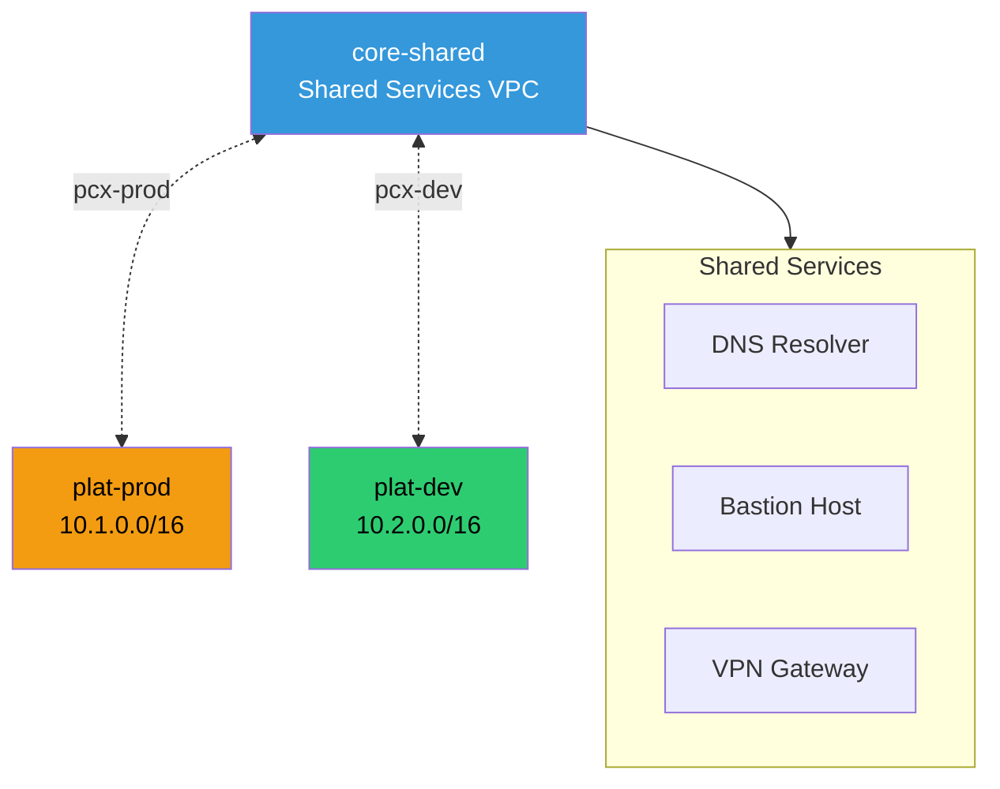

# VPC Peering

Direct VPC-to-VPC connectivity for simpler topologies without Transit Gateway.

## Key Features

- **Direct Connectivity**: Low-latency, high-bandwidth connection between VPCs
- **Non-Transitive**: Each VPC pair requires separate peering connection
- **No Single Point of Failure**: Peering connections are redundant and fault-tolerant
- **Cost-Effective**: Lower cost than Transit Gateway for simple topologies
- **Security Groups**: Can reference security groups across peered VPCs

## Use Cases

### Shared Services Access
- DNS resolution via Route 53 Resolver endpoints
- Bastion host access for SSH/RDP
- VPN Gateway for site-to-site connectivity

### Cross-Account Peering
- Peer VPCs across different AWS accounts
- Requires acceptance from both sides
- IAM permissions needed for peering creation

## Limitations

- **Non-Transitive**: VPC A cannot reach VPC C through VPC B
- **CIDR Overlap**: Peered VPCs cannot have overlapping CIDR blocks
- **Route Table Updates**: Manual route table updates required for each peering
- **Scalability**: Complex mesh topology with many VPCs

## When to Use Transit Gateway Instead

- More than 3-4 VPCs need connectivity
- Centralized routing and firewall inspection required
- Need transitive routing between VPCs
- Simplified route table management desired
