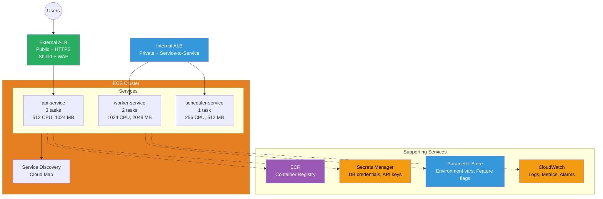

# ECS Architecture

Container orchestration with Fargate and EC2 capacity providers, internal/external ALBs, and Service Discovery.

## Problems this Architecture solves

- Standardizes how containerized services are exposed, discovered, and scaled in ECS.
- Reduces operational overhead for teams that need managed runtime options without building cluster primitives from scratch.
- Centralizes secrets, parameters, logs, and deployment behavior around a repeatable service pattern.

## Key Features

- **Fargate**: Serverless compute, no EC2 management
- **Service Discovery**: Cloud Map for DNS-based service discovery
- **External ALB**: Public-facing HTTPS with WAF/Shield
- **Internal ALB**: Private service-to-service communication
- **Auto Scaling**: Target tracking based on CPU/memory/ALB metrics
- **Blue-Green Deployments**: CodeDeploy integration for zero-downtime

## Capacity Providers

### FARGATE
- Serverless compute, pay per vCPU/memory
- No infrastructure management
- Best for: Most workloads

### FARGATE_SPOT
- Up to 70% cost savings
- Can be interrupted with 2-minute warning
- Best for: Fault-tolerant batch jobs

### EC2
- Self-managed instances with ECS agent
- More control over instance type/AMI
- Best for: GPU workloads, reserved capacity

### EC2_SPOT
- Up to 90% cost savings
- Can be interrupted
- Best for: Stateless, fault-tolerant workloads

## Service Configuration

### api-service
- **Tasks**: 3 (high availability)
- **CPU**: 512 (0.5 vCPU)
- **Memory**: 1024 MB
- **Load Balancer**: External ALB
- **Health Check**: /health endpoint

### worker-service
- **Tasks**: 2
- **CPU**: 1024 (1 vCPU)
- **Memory**: 2048 MB
- **Load Balancer**: Internal ALB
- **Trigger**: SQS queue

### scheduler-service
- **Tasks**: 1
- **CPU**: 256 (0.25 vCPU)
- **Memory**: 512 MB
- **Schedule**: EventBridge cron
- **Purpose**: Background jobs

## Supporting Services

- **ECR**: Private container registry with image scanning
- **Secrets Manager**: Automatic rotation for DB credentials
- **Parameter Store**: Environment variables and feature flags
- **CloudWatch**: Logs, metrics, and alarms for monitoring
