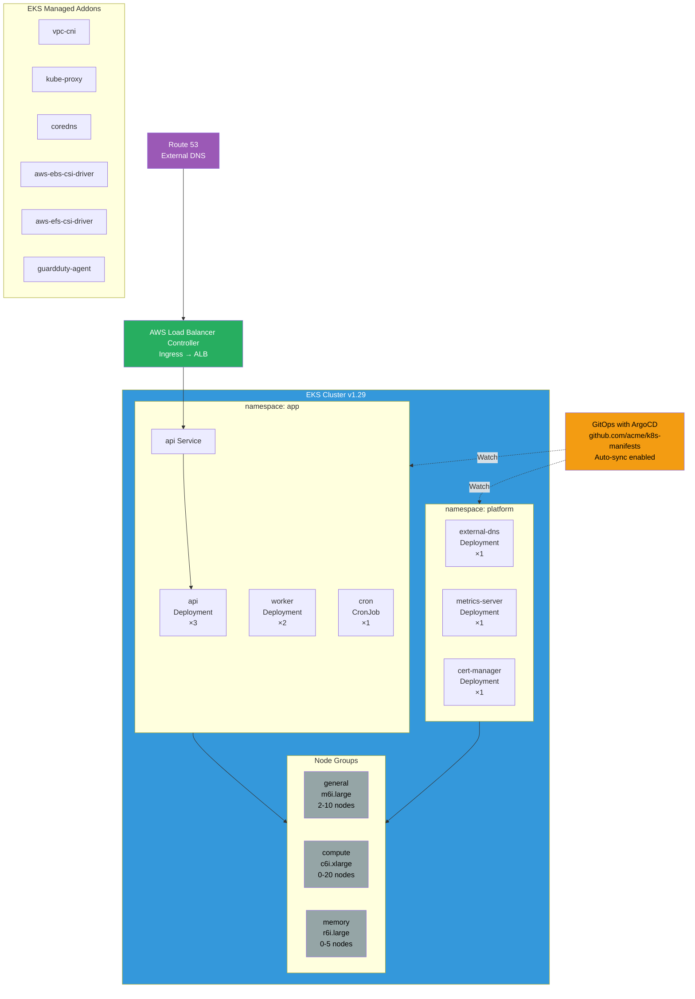

# EKS Architecture

Managed Kubernetes with Karpenter autoscaling and GitOps deployment via ArgoCD.

## Key Features

- **Managed Control Plane**: AWS manages Kubernetes control plane (API server, etcd)
- **Karpenter**: Just-in-time node provisioning based on pod requirements
- **GitOps**: ArgoCD syncs manifests from Git to cluster
- **AWS Load Balancer Controller**: Provisions ALB/NLB from Ingress resources
- **Service Mesh**: Optional Istio/Linkerd for observability
- **Auto-Scaling**: HPA for pods, Karpenter for nodes

## Node Groups

### general
- **Instance Type**: m6i.large (2 vCPU, 8 GB)
- **Scaling**: 2-10 nodes
- **Purpose**: General-purpose workloads
- **Taints**: None

### compute
- **Instance Type**: c6i.xlarge (4 vCPU, 8 GB)
- **Scaling**: 0-20 nodes
- **Purpose**: CPU-intensive workloads
- **Taints**: workload=compute:NoSchedule

### memory
- **Instance Type**: r6i.large (2 vCPU, 16 GB)
- **Scaling**: 0-5 nodes
- **Purpose**: Memory-intensive workloads
- **Taints**: workload=memory:NoSchedule

## Namespaces

### app
- Application workloads (api, worker, cron)
- Resource quotas and limits enforced
- Network policies for isolation

### platform
- Platform services (external-dns, cert-manager, metrics-server)
- Cluster-wide addons
- Elevated permissions

## EKS Managed Addons

- **vpc-cni**: AWS VPC networking for pods
- **kube-proxy**: Network proxy for Services
- **coredns**: DNS server for service discovery
- **aws-ebs-csi-driver**: EBS volumes for persistent storage
- **aws-efs-csi-driver**: EFS for shared storage
- **guardduty-agent**: Runtime threat detection

## GitOps with ArgoCD

- **Repository**: github.com/acme/k8s-manifests
- **Auto-Sync**: Automatically apply changes from Git
- **Self-Heal**: Revert manual changes to match Git
- **Pruning**: Delete resources removed from Git
- **App of Apps**: Manage multiple applications
