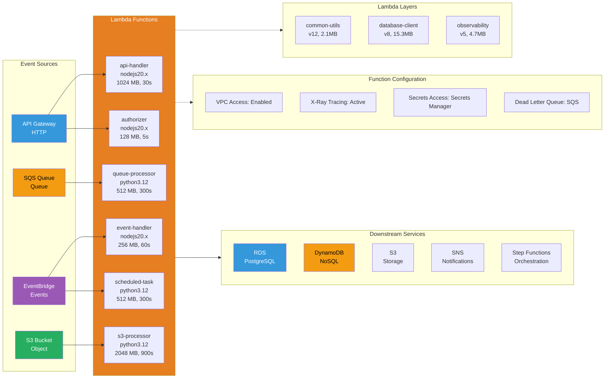

# Lambda Architecture

Event-driven serverless compute with multiple trigger sources and VPC integration.

## Key Features

- **Event-Driven**: Triggered by API Gateway, SQS, EventBridge, S3, etc.
- **Auto-Scaling**: Scales from 0 to thousands of concurrent executions
- **VPC Access**: Connect to RDS, ElastiCache, and other VPC resources
- **Lambda Layers**: Share code and dependencies across functions
- **Provisioned Concurrency**: Pre-warmed instances for low latency
- **Dead Letter Queue**: Capture failed invocations for retry

## Lambda Functions

### api-handler
- **Runtime**: nodejs20.x
- **Memory**: 1024 MB
- **Timeout**: 30s
- **Trigger**: API Gateway HTTP requests
- **Purpose**: REST API endpoints

### queue-processor
- **Runtime**: python3.12
- **Memory**: 512 MB
- **Timeout**: 300s (5 min)
- **Trigger**: SQS queue messages
- **Purpose**: Async background processing

### event-handler
- **Runtime**: nodejs20.x
- **Memory**: 256 MB
- **Timeout**: 60s
- **Trigger**: EventBridge events
- **Purpose**: Event-driven workflows

### s3-processor
- **Runtime**: python3.12
- **Memory**: 2048 MB
- **Timeout**: 900s (15 min)
- **Trigger**: S3 object creation
- **Purpose**: File processing (images, videos, documents)

### authorizer
- **Runtime**: nodejs20.x
- **Memory**: 128 MB
- **Timeout**: 5s
- **Trigger**: API Gateway authorizer
- **Purpose**: JWT validation, custom auth

### scheduled-task
- **Runtime**: python3.12
- **Memory**: 512 MB
- **Timeout**: 300s
- **Trigger**: EventBridge cron schedule
- **Purpose**: Periodic maintenance tasks

## Lambda Layers

### common-utils (v12, 2.1MB)
- Shared utility functions
- Logging and error handling
- Configuration management

### database-client (v8, 15.3MB)
- PostgreSQL client library
- Connection pooling
- Query helpers

### observability (v5, 4.7MB)
- X-Ray SDK
- CloudWatch metrics
- Structured logging

## Function Configuration

- **VPC Access**: Connect to RDS and ElastiCache in private subnets
- **X-Ray Tracing**: Distributed tracing for debugging
- **Secrets Access**: Retrieve credentials from Secrets Manager
- **Dead Letter Queue**: SQS queue for failed invocations

## Downstream Services

- **RDS**: PostgreSQL for relational data
- **DynamoDB**: NoSQL for high-throughput workloads
- **S3**: Object storage for files and artifacts
- **SNS**: Pub/sub notifications
- **Step Functions**: Orchestrate complex workflows
