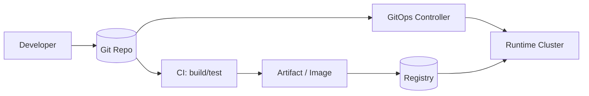

```mermaid
flowchart LR
  Dev[Developer] --> Git[(Git Repo)]
  Git --> CI[CI: build/test]
  CI --> Img[Artifact / Image]
  Img --> Reg[(Registry)]
  Git --> CD[GitOps Controller]
  CD --> Cluster[Runtime Cluster]
  Reg --> Cluster
```

## Notes
- Keep CI and GitOps separate: CI produces artifacts; GitOps reconciles desired state.
