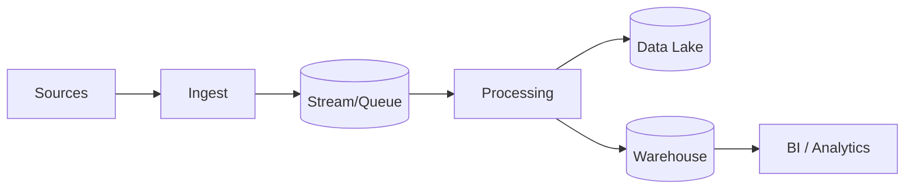

```mermaid
flowchart LR
  Src[Sources] --> Ingest[Ingest]
  Ingest --> Stream[(Stream/Queue)]
  Stream --> Proc[Processing]
  Proc --> Lake[(Data Lake)]
  Proc --> DW[(Warehouse)]
  DW --> BI[BI / Analytics]
```

## Notes
- Use as a generic mental model; replace nodes with specific services per stack.
