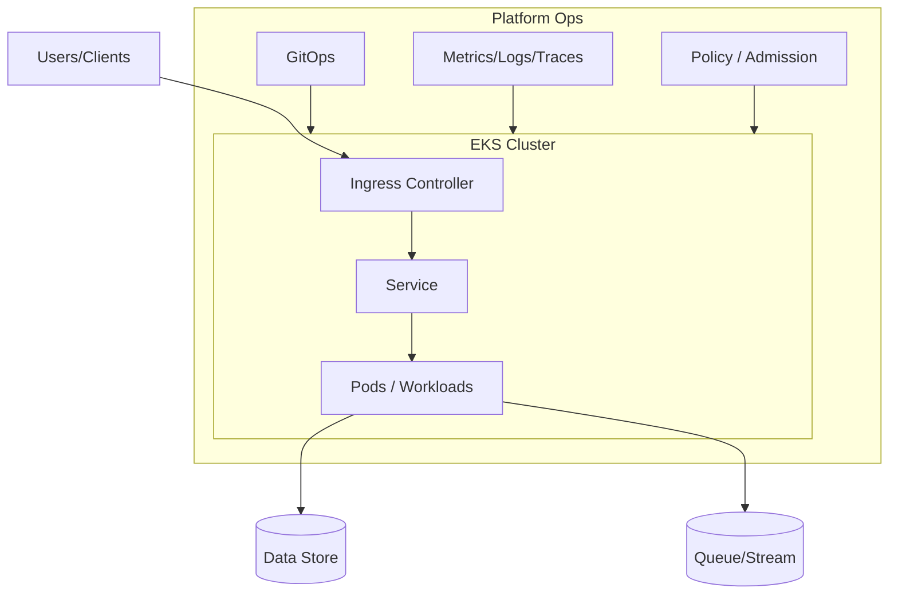

```mermaid
flowchart TB
  Users[Users/Clients] --> Ingress[Ingress Controller]
  Ingress --> Svc[Service]
  Svc --> Pods[Pods / Workloads]
  Pods --> Data[(Data Store)]
  Pods --> Queue[(Queue/Stream)]

  subgraph Cluster[EKS Cluster]
    Ingress
    Svc
    Pods
  end

  subgraph Ops[Platform Ops]
    Git[GitOps] --> Cluster
    Obs[Metrics/Logs/Traces] --> Cluster
    Sec[Policy / Admission] --> Cluster
  end
```

## Notes
- Use for platform overviews: how workloads reach services and where guardrails sit.
