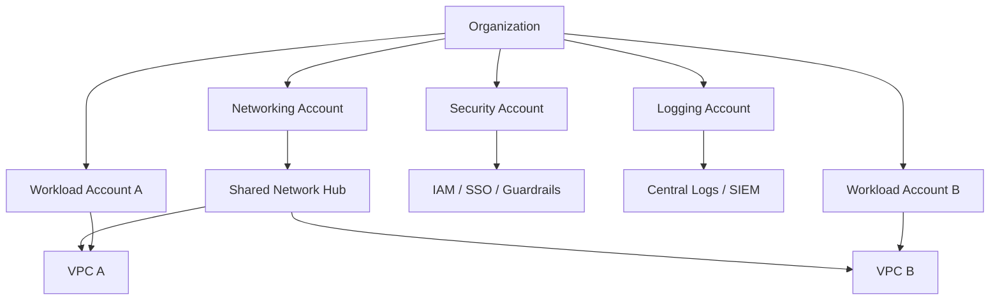

```mermaid
flowchart TB
  Org[Organization] --> Sec[Security Account]
  Org --> Log[Logging Account]
  Org --> Net[Networking Account]
  Org --> App1[Workload Account A]
  Org --> App2[Workload Account B]

  Sec --> IAM[IAM / SSO / Guardrails]
  Log --> SIEM[Central Logs / SIEM]
  Net --> Hub[Shared Network Hub]

  Hub --> VPC1[VPC A]
  Hub --> VPC2[VPC B]
  App1 --> VPC1
  App2 --> VPC2
```

## Notes
- Keep this conceptual. Add specific services only when documenting a real implementation.
- Add data classification + ownership callouts as needed.
