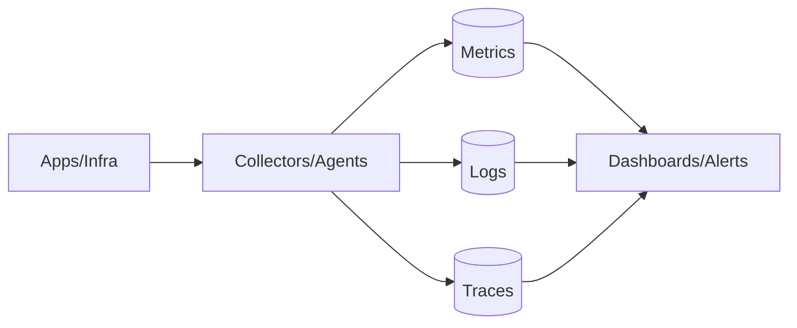

```mermaid
flowchart LR
  Apps[Apps/Infra] --> Collect[Collectors/Agents]
  Collect --> Metrics[(Metrics)]
  Collect --> Logs[(Logs)]
  Collect --> Traces[(Traces)]
  Metrics --> Dash[Dashboards/Alerts]
  Logs --> Dash
  Traces --> Dash
```

## Notes
- Add routing + retention callouts when formalizing the design.
