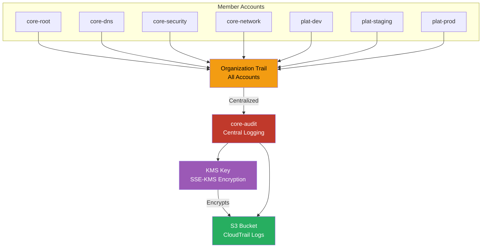

# CloudTrail Architecture

Organization-wide CloudTrail logs centralized in the audit account S3 bucket with encryption at rest.

## Key Features

- **Organization Trail**: Single trail captures API activity from all accounts in the organization
- **Centralized Storage**: All logs stored in core-audit account S3 bucket
- **Encryption at Rest**: SSE-KMS encryption with customer-managed key
- **Immutable Logs**: S3 Object Lock prevents deletion or modification
- **Log File Validation**: Ensures log integrity with digital signatures
- **Athena Integration**: Query logs using SQL for security analysis
- **EventBridge Integration**: Real-time alerting on critical API calls

## What's Logged

- **Management Events**: Control plane operations (CreateBucket, RunInstances, etc.)
- **Data Events**: Data plane operations (S3 GetObject, Lambda Invoke, etc.)
- **Insights Events**: Unusual API activity detection
- **Global Services**: IAM, STS, CloudFront logged in us-east-1

## Retention & Analysis

- **S3 Lifecycle**: Transition to Glacier after 90 days, delete after 7 years
- **Athena Queries**: Ad-hoc analysis of API activity
- **CloudWatch Logs**: Real-time monitoring with metric filters
- **Security Hub**: Automated findings for suspicious activity
