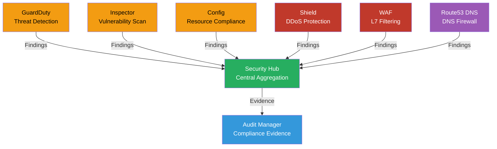

# Compliance Monitoring

Centralized compliance monitoring with Security Hub, GuardDuty threat detection, and AWS Config.

## Problems this Architecture solves

- Consolidates findings from multiple AWS security services into one place for triage and reporting.
- Reduces manual evidence gathering for compliance programs by centralizing signals and audit data.
- Shortens the path from detection to action for high-severity findings across accounts.

## Key Features

- **GuardDuty**: Continuous threat detection analyzing VPC Flow Logs, CloudTrail, and DNS logs
- **Inspector**: Automated vulnerability scanning for EC2, ECR, and Lambda
- **AWS Config**: Resource compliance tracking with managed and custom rules
- **Security Hub**: Central aggregation point for all security findings across accounts
- **Audit Manager**: Automated evidence collection for compliance frameworks (SOC 2, PCI-DSS, HIPAA)
- **AWS Shield**: DDoS protection at L3/L4 with automatic mitigation
- **WAF**: Layer 7 attack mitigation with custom rules
- **Route53 DNS Firewall**: Block malicious domains at DNS level

## Security Findings Flow

1. Detection services (GuardDuty, Inspector, Config) continuously monitor resources
2. Findings are sent to Security Hub in the core-security account
3. Security Hub aggregates and prioritizes findings
4. Audit Manager collects evidence for compliance reporting
5. Alerts trigger notifications via SNS/EventBridge for critical findings
