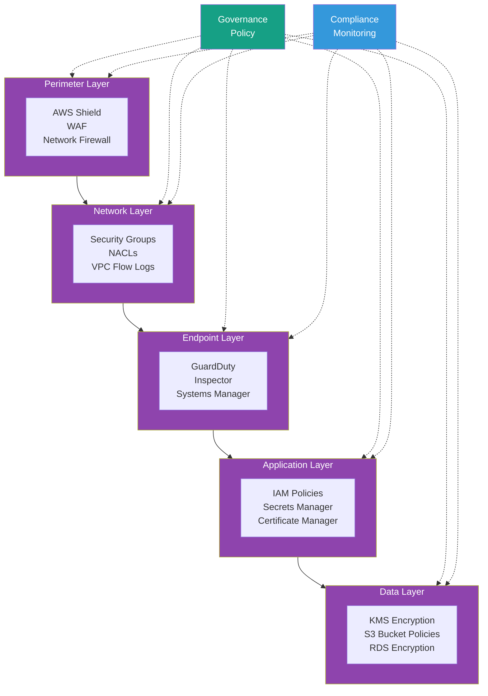

# Defense in Depth

Multi-layer security with AWS Shield, WAF, Network Firewall, and DNS Firewall spanning 8 security layers.

## Security Layers

### 1. Perimeter Layer
- **AWS Shield Advanced**: DDoS protection with 24/7 DRT support
- **WAF**: Layer 7 attack mitigation (SQL injection, XSS, rate limiting)
- **Network Firewall**: Stateful inspection and IDS/IPS capabilities

### 2. Network Layer
- **Security Groups**: Stateful firewall at instance level
- **NACLs**: Stateless firewall at subnet level
- **VPC Flow Logs**: Network traffic visibility and analysis

### 3. Endpoint Layer
- **GuardDuty**: Threat detection for EC2, containers, and serverless
- **Inspector**: Vulnerability and patch management
- **Systems Manager**: Patch automation and configuration management

### 4. Application Layer
- **IAM Policies**: Least-privilege access control
- **Secrets Manager**: Secure credential storage with rotation
- **Certificate Manager**: TLS/SSL certificate management

### 5. Data Layer
- **KMS Encryption**: Encryption at rest for all data stores
- **S3 Bucket Policies**: Fine-grained access control
- **RDS Encryption**: Database encryption with automated backups

## Cross-Cutting Concerns

### Governance (Policy)
- Service Control Policies (SCPs) at OU level
- IAM permission boundaries
- Resource tagging policies
- Backup policies

### Compliance (Monitoring)
- Security Hub for centralized findings
- Config rules for compliance checks
- Audit Manager for evidence collection
- CloudWatch alarms for security events

## Key Features

- Multiple security layers with Governance (Policy) and Compliance (Monitoring) spanning all layers
- Defense in depth approach ensures no single point of failure
- Automated compliance monitoring and remediation
- Centralized security operations in core-security account
