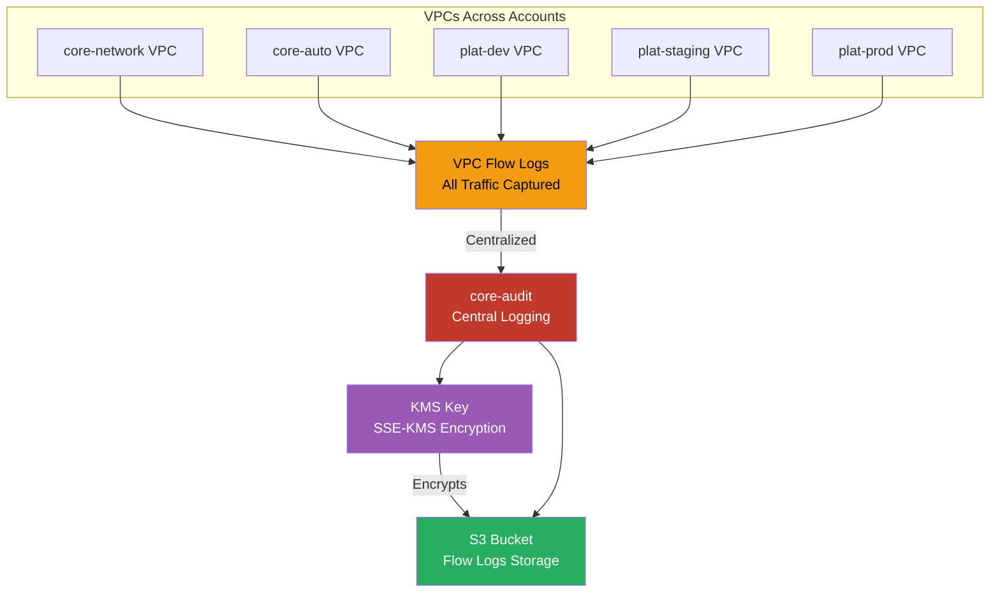

# VPC Flow Logs

VPC Flow Logs from all accounts centralized in the audit account for network visibility.

## Problems this Architecture solves

- Provides a shared network audit trail instead of leaving traffic visibility fragmented by account.
- Makes suspicious east-west and north-south traffic easier to investigate during incidents.
- Supports troubleshooting, compliance, and traffic analysis without depending on per-team log storage decisions.

## Key Features

- **All VPCs**: Flow logs enabled on every VPC across all accounts
- **Centralized Storage**: Logs delivered to core-audit S3 bucket
- **Encryption**: SSE-KMS encryption with customer-managed key
- **Athena Queries**: Analyze network traffic patterns with SQL
- **GuardDuty Integration**: Threat detection using flow log analysis
- **Custom Format**: Capture specific fields for cost optimization

## What's Captured

- **Source/Destination**: IP addresses and ports
- **Protocol**: TCP, UDP, ICMP
- **Action**: ACCEPT or REJECT
- **Bytes/Packets**: Traffic volume
- **Flow Direction**: Ingress or egress
- **VPC Endpoint**: Traffic through VPC endpoints

## Use Cases

- **Security Analysis**: Identify unauthorized access attempts
- **Network Troubleshooting**: Debug connectivity issues
- **Cost Optimization**: Identify high-traffic endpoints
- **Compliance**: Network activity audit trail
- **Threat Detection**: Unusual traffic patterns

## Analysis Tools

- **Athena**: SQL queries for ad-hoc analysis
- **CloudWatch Insights**: Real-time log analysis
- **VPC Flow Logs Insights**: Built-in analysis tool
- **Third-party SIEM**: Export to Splunk, Datadog, etc.
